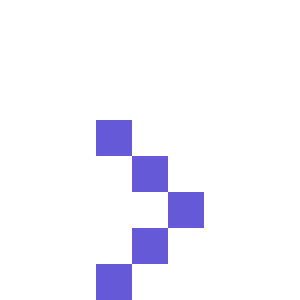

<!--
**CyberZik/cyberzik** is a ✨ _special_ ✨ repository because its `README.md` (this file) appears on your GitHub profile.

Here are some ideas to get you started:

- 🔭 I’m currently working on ...
- 🌱 I’m currently learning ...
- 👯 I’m looking to collaborate on ...
- 🤔 I’m looking for help with ...
- 💬 Ask me about ...
- 📫 How to reach me: ...
- 😄 Pronouns: ...
- ⚡ Fun fact: ...
-->

	
	<i><h1 align="center"> <code>"What can I do for you?"</code> </h1></i>

| `SELECT A CHOICE`  |
| ------------- |
|  <a href="https://github.com/">`Something!`</a> 
<i>Too Lazy to build something!</i>
  |
|  <a href="https://github.com/">`Something!`</a> 
<i>Tool for something </i>
  |
|  <a href="https://github.com/">`Something!`</a> 
<i>Extension for something </i>
  |
|  <a href="https://github.com/">`Something!`</a> 
<i>Script for something for something </i>
  |
|  <a href="https://github.com/">`Something!`</a> 
<i>VM for something </i>
  |
|  <a href="https://github.com/">`Something!`</a> 
<i>Something for something </i>
  |

# Hello, I'm Shubham (iMazik)

">.  
Red & Blue Teaming | VAPT | SOC | Threat Intelligence | Digital Forensics | Incident Response | Malware Analysis | Network & Web Security | Mobile Security | Audit and Compliance

## About Me
My Hobby is to find flaws in a system and secure them. So, if I am in your system don't be worry I just help people to build more safer and secure world :).  
My journey in computer science has led me to develop a passion for cybersecurity, and after my Masters in this field , I am now eager to transition into the professional world , specifically aiming to join a Security Operations Center (SOC) as a Tier 1 Analyst.

## Skills
| Skill                                         | Associated Project         |
|-----------------------------------------------|----------------------------|
| SIEM Implementation and Log Analysis          | <a href="https://google.com">Detection Lab</a>|
| Network Traffic Monitoring and Attack Detection | <a href="https://google.com">Detection Lab</a>|
| Security Automation with Shuffle SOAR         | SOC Automation Lab|
| Incident Response Planning and Execution      | SOC Automation Lab|
| Case Management with TheHive                  | SOC Automation Lab|
| Scripting and Automation for Threat Mitigation | SOC Automation Lab|

## Tools

### Network

    
    
    

### Endpoint

    
    

### SIEM

    
    
    

## Certifications

My seniors told me skills get you job not certifications -^-.

